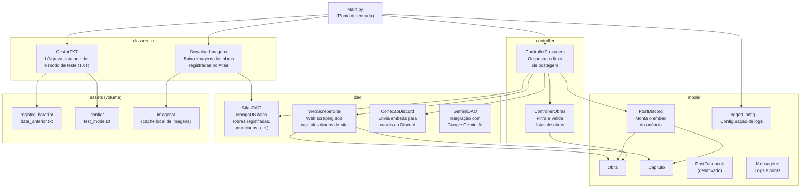

# Bot de notificações no Discord

Bot que monitora lançamentos de capítulos em um site de mangás/webtoons e realiza postagens automáticas de anúncio em canais do Discord.

---

## Arquitetura do Projeto



### Fluxo principal

1. **GestorTXT** lê a data da última execução e o modo de teste.
2. **DownloadImagens** sincroniza o cache local de imagens com os dados do MongoDB Atlas.
3. **WebScreperSite** faz scraping do site e retorna a lista de obras com capítulos lançados no dia.
4. **ControllerObras** filtra obras não registradas no Atlas e remove capítulos já anunciados.
5. **ControllerPostagem** itera sobre as obras restantes, monta um `PostDiscord` e envia o embed via **ConexaoDiscord**.
6. O registro de obras anunciadas é persistido no MongoDB Atlas para evitar duplicatas.

### Variáveis de ambiente (`.env`)

#### Discord

| Variável | Descrição |
|---|---|
| `API_KEY` | Token do bot Discord. Obtido em https://discord.com/developers/applications → Bot → Token |
| `CANAL_LANCAMENTOS` | ID do canal onde os anúncios de lançamentos são postados em produção |
| `CANAL_TESTES` | ID do canal usado quando o bot é executado em modo de teste |
| `CANAL_TAGS` | ID do canal de tags/cargos, usado para menções nos embeds |

#### MongoDB Atlas

| Variável | Descrição |
|---|---|
| `URI_ATLAS` | URI de conexão com o cluster MongoDB Atlas. Formato: `mongodb+srv://<user>:<password>@<cluster>.mongodb.net/` |

#### Google Gemini

| Variável | Descrição |
|---|---|
| `GEMINI_API` | Chave da API do Google Gemini AI. Obtida em https://aistudio.google.com/app/apikey |

#### Facebook

| Variável | Descrição |
|---|---|
| `API_ID_PAGINA_FACEBOOK` | ID numérico da página do Facebook de produção onde os posts serão publicados |
| `API_TOKEN_PAGINA` | Page Access Token da página de produção. Deve ter as permissões `pages_manage_posts` e `pages_read_engagement` |
| `API_ID_PAGINA_FACEBOOK_TESTE` | ID numérico da página de teste (usada apenas quando `ENABLE_FB_TEST=true`) |
| `API_TOKEN_PAGINA_TESTE` | Page Access Token da página de teste |
| `ENABLE_FB_TEST` | `"true"` para habilitar os testes unitários de postagem no Facebook. Por padrão `"false"` para evitar postagens acidentais |

---

## Configuração do Facebook

### Pré-requisitos

- Conta de desenvolvedor Meta: https://developers.facebook.com
- App criado no painel de desenvolvedores (tipo: **Business**)
- Página do Facebook onde os posts serão publicados
- A conta deve ser **Administrador** da página

### 1. Criar o App no Meta for Developers

1. Acesse https://developers.facebook.com/apps
2. Clique em **Create App** → selecione o tipo **Business**
3. Preencha o nome do app e o e-mail de contato
4. O app começa no modo **Desenvolvimento** — suficiente para testes

### 2. Configurar permissões do App

1. No painel do app, vá em **App Review → Permissions and Features**
2. Certifique-se de que as seguintes permissões estão presentes:
   - `pages_manage_posts` ✅
   - `pages_read_engagement` ✅
   - `pages_show_list` ✅
3. **Remova** `publish_actions` se estiver listado — está **deprecated** e bloqueia qualquer postagem com erro 403

### 3. Gerar o Page Access Token

O token necessário é um **Page Access Token**, não um User Token.

1. Acesse https://developers.facebook.com/tools/explorer
2. Selecione o seu app no dropdown **"App da Meta"**
3. Em **Permissions**, adicione:
   - `pages_manage_posts`
   - `pages_read_engagement`
   - `pages_show_list`
4. Clique em **Generate Access Token** e autorize
5. No campo da query, coloque `/me/accounts` e clique **Enviar**
6. Na resposta JSON, localize a página desejada dentro de `data[]`:
   ```json
   {
     "data": [
       {
         "name": "Nome da Página",
         "id": "110041288738055",
         "access_token": "EAACxxx..."
       }
     ]
   }
   ```
7. Copie o `access_token` e o `id` da página

> ⚠️ O token gerado pelo Explorer é de **curta duração** (~1h). Para produção, converta para long-lived token via:
> ```
> GET https://graph.facebook.com/v25.0/oauth/access_token
>   ?grant_type=fb_exchange_token
>   &client_id={app_id}
>   &client_secret={app_secret}
>   &fb_exchange_token={short_lived_token}
> ```

### 4. Atualizar o `.env`

```ini
API_ID_PAGINA_FACEBOOK = "ID_DA_PAGINA"
API_TOKEN_PAGINA = "PAGE_ACCESS_TOKEN"

# Para testes (pode ser a mesma página ou uma página separada)
API_ID_PAGINA_FACEBOOK_TESTE = "ID_DA_PAGINA_TESTE"
API_TOKEN_PAGINA_TESTE = "PAGE_ACCESS_TOKEN_TESTE"
ENABLE_FB_TEST = "false"
```

### 5. Testar a integração

```bash
# Habilitar testes de Facebook no .env:
ENABLE_FB_TEST = "true"

# Executar apenas os testes de Facebook:
pytest tests/test_dao_conexao_facebook.py -v
```

> Ao terminar os testes, retorne `ENABLE_FB_TEST = "false"` para evitar postagens acidentais nas próximas execuções do `pytest`.

---

## Estrutura de diretórios

```
bot-notification/
├── src/
│   ├── Main.py                      # Ponto de entrada
│   ├── classes_io/
│   │   ├── download_imagens.py      # Download de imagens das obras
│   │   └── gestor_txt.py            # Leitura/escrita de arquivos TXT
│   ├── controller/
│   │   ├── controller_obras.py      # Filtragem e validação de obras
│   │   └── controller_postagem.py   # Orquestração do fluxo de postagem
│   ├── dao/
│   │   ├── atlas_dao.py             # Acesso ao MongoDB Atlas
│   │   ├── conexao_discord.py       # Envio de mensagens ao Discord
│   │   ├── conexao_facebook.py      # Integração Facebook (desativada)
│   │   ├── gemini_dao.py            # Integração Google Gemini AI
│   │   └── web_screper_site.py      # Web scraping do site de mangás
│   ├── endpoint/
│   │   ├── bot_endpoint.py
│   │   └── pagination.py
│   └── model/
│       ├── capitulo.py              # Entidade Capítulo
│       ├── logger_config.py         # Configuração de loggers
│       ├── mensagens.py             # Mensagens de log/console
│       ├── obra.py                  # Entidade Obra
│       └── posts/
│           ├── post_discord.py      # Modelo do embed Discord
│           └── post_facebook.py     # Modelo do post Facebook (desativado)
├── assets/                          # Volume Docker (persistente)
│   ├── config/
│   │   └── test_mode.txt            # "true" para modo de teste
│   ├── imagens/                     # Cache local de capas das obras
│   └── registro_horario/
│       └── data_anterior.txt        # Data da última execução
├── tests/                           # Testes unitários (pytest)
├── Dockerfile
├── Dockerfile-dev
└── requirements.txt
```

---

## Instruções para desenvolvimento

A versão do Python utilizada é: `python:3.10`

Para criar o ambiente, utilize:
```bash
python3 -m venv venv
source venv/bin/activate
```

Para instalar as dependências do projeto:
```bash
pip install -r requirements.txt
```

Para executar os testes:
```bash
pytest
```

---

## Docker

A imagem utiliza volume para persistir os dados em `assets/`. Crie o volume antes de rodar:

```bash
docker volume create <nome-do-volume>
```

Construir a imagem:
```bash
docker build -t bot-notif:<versao-do-bot> .
```

Executar o container:
```bash
docker run -d -v <nome-do-volume>:/home/project/assets bot-notif:<versao-do-bot>
```

Acompanhar a saída do bot:
```bash
docker attach <id-do-container>
```

Encontrar o ID do container:
```bash
docker ps
```